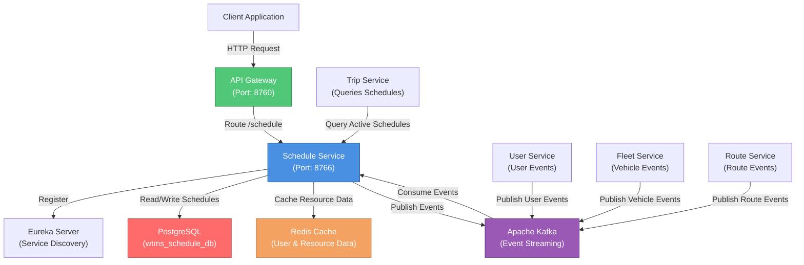
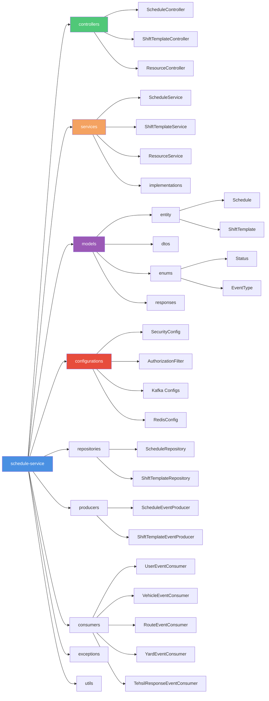
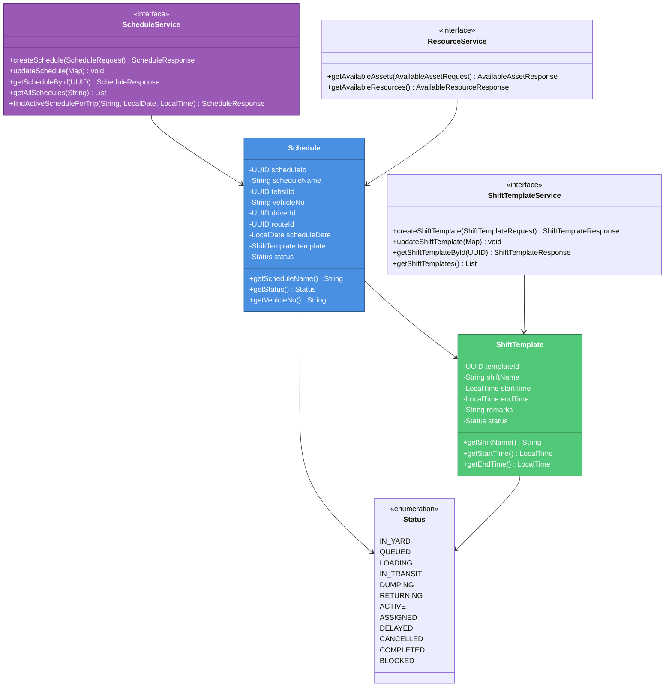

# Schedule Service - WTMS (Waste Transportation Management System)

## Service Overview

The **Schedule Service** is the core scheduling and resource allocation microservice within the WTMS ecosystem. It manages waste collection schedules, shift templates, and real-time resource availability for waste collection operations. This service orchestrates the assignment of vehicles, drivers, and routes to specific collection tasks with precise time-based scheduling.

### Key Responsibilities

- **Waste Collection Scheduling**: Creates and manages daily schedules for waste collection trips with assigned vehicles, drivers, and routes
- **Shift Template Management**: Maintains reusable shift templates (e.g., 6:00 AM - 2:00 PM, 2:00 PM - 10:00 PM) for consistent scheduling patterns
- **Real-Time Resource Availability**: Tracks available vehicles, drivers, and equipment with status monitoring for dispatch operations
- **Status Lifecycle Management**: Manages detailed trip status transitions (IN_YARD, QUEUED, LOADING, IN_TRANSIT, DUMPING, RETURNING, COMPLETED)
- **Cross-Service Event Consumption**: Ingests events from User, Fleet, Route, Tehsil, and Yard services to maintain data consistency
- **Schedule Query Service**: Provides microservice endpoints for Trip Service to query active schedules and determine vehicle availability
- **Dispatch Support**: Enables supervisors to manage dispatch operations with real-time vehicle and equipment checks
- **Schedule Status Tracking**: Maintains full audit trail of schedule lifecycle from creation to completion
- **Event Publishing**: Publishes schedule and shift template events to Kafka for downstream services

### Business Context

The Schedule Service acts as the **operational orchestration layer** for WTMS. It bridges between strategic fleet management (Fleet Service) and tactical trip execution (Trip Service). Supervisors use this service to create daily schedules, while Trip Service queries it for vehicle availability and schedule details during trip creation. The service ensures efficient utilization of resources and prevents double-booking of vehicles or drivers.

---

## Architecture & Design

### High-Level Architecture Diagram



### Package Diagram (Internal Structure)



### Class Diagram (Core Domain Model)



---

## Setup & Execution

### Prerequisites

Ensure the following services and tools are installed and running on your machine:

- **Java Development Kit (JDK)**: Version 17 or higher
- **Apache Maven**: Version 3.8.1 or higher
- **PostgreSQL**: Version 13+ (for schedule database storage)
- **Apache Kafka**: Version 3.0+ (for event streaming)
- **Redis**: Version 6.0+ (for resource and user data caching)
- **Eureka Server**: Running on `http://localhost:8761/eureka/` (for service discovery)
- **Other Services**: User Service, Fleet Service, and Trip Service for integration

### Step 1: Clone the Repository

```bash
git clone <repository-url>
cd BackEnd/schedule-service
```

### Step 2: Configure Environment Variables

Update `src/main/resources/application.properties` with your environment-specific values:

```properties
# Database Configuration
spring.datasource.url=jdbc:postgresql://localhost:5432/wtms_schedule_db
spring.datasource.username=admin
spring.datasource.password=your_strong_password

# JWT Configuration (for token validation)
jwt.public-key.path=classpath:certs/public_key.pem
app.security.internal-secret=your_secret_key

# Kafka Configuration
kafka.bootstrap.server=localhost:9092
kafka.consumer.group=schedule-group

# Redis Configuration
spring.data.redis.host=localhost
spring.data.redis.port=6379
spring.data.redis.database=3

# Eureka Configuration
eureka.client.service-url.defaultZone=http://localhost:8761/eureka/
```

### Step 3: Build the Service

```bash
# Clean and build with Maven
mvn clean install

# Or skip tests for faster build
mvn clean install -DskipTests
```

### Step 4: Run the Service Locally

```bash
# Option 1: Using Maven Spring Boot plugin
mvn spring-boot:run

# Option 2: Run the generated JAR
java -jar target/schedule-service-0.0.1-SNAPSHOT.jar
```

### Step 5: Verify the Service

Once the service is running, verify its status:

```bash
# Health Check
curl -X GET http://localhost:8766/actuator/health

# Check Eureka Registration
curl -X GET http://localhost:8761/eureka/apps/schedule-service

# Swagger UI (OpenAPI Documentation)
# Open in browser: http://localhost:8766/swagger-ui.html
```

### Default Port Configuration

| Service | Port | Description |
|---------|------|-------------|
| Schedule Service | `8766` | Schedule & Resource Management |
| Eureka Server | `8761` | Service Discovery |
| Kafka | `9092` | Event Streaming |
| PostgreSQL | `5432` | Schedule Database |
| Redis | `6379` | Resource & User Data Cache |

---

## Environment Variables & Application Properties

### Required Configuration Table

| Property | Type | Default | Description | Example |
|----------|------|---------|-------------|---------|
| `spring.application.name` | String | `schedule-service` | Microservice identifier | `schedule-service` |
| `server.port` | Integer | `8766` | HTTP server port | `8766` |
| `spring.datasource.url` | String | Required | PostgreSQL connection URL | `jdbc:postgresql://localhost:5432/wtms_schedule_db` |
| `spring.datasource.username` | String | Required | Database username | `admin` |
| `spring.datasource.password` | String | Required | Database password (strong) | `your_strong_password` |
| `spring.jpa.hibernate.ddl-auto` | String | `update` | Schema generation strategy | `update` / `create` / `validate` |
| `jwt.public-key.path` | String | Required | Path to RSA public key (PEM) | `classpath:certs/public_key.pem` |
| `app.security.internal-secret` | String | Required | Internal API secret key (minimum 32 chars) | `yK8!pL3@xQ7#dT9$wF2^sR5&vM1*bN6(` |
| `kafka.bootstrap.server` | String | Required | Kafka broker address | `localhost:9092` |
| `kafka.consumer.group` | String | `schedule-group` | Kafka consumer group ID | `schedule-group` |
| `spring.data.redis.host` | String | Required | Redis server hostname | `localhost` |
| `spring.data.redis.port` | Integer | `6379` | Redis server port | `6379` |
| `spring.data.redis.database` | Integer | `3` | Redis database number | `3` |
| `eureka.client.register-with-eureka` | Boolean | `true` | Register service with Eureka | `true` |
| `eureka.client.service-url.defaultZone` | String | Required | Eureka server URL | `http://localhost:8761/eureka/` |
| `eureka.instance.prefer-ip-address` | Boolean | `true` | Use IP address instead of hostname | `true` |
| `management.tracing.sampling.probability` | Float | `1.0` | Distributed tracing sample rate (0.0-1.0) | `1.0` |
| `logging.level.org.hibernate.SQL` | String | `DEBUG` | Hibernate SQL logging level | `DEBUG` / `INFO` |
| `spring.jpa.show-sql` | Boolean | `false` | Print SQL statements to console | `false` / `true` |

### Kafka Topics Configuration

| Topic | Consumer Group | Producer | Purpose |
|-------|----------------|----------|---------|
| `user-response-topic` | `schedule-group` | User Service | User status and profile events |
| `vehicle-event-topic` | `schedule-group` | Fleet Service | Vehicle availability and status events |
| `route-response-topic` | `schedule-group` | Fleet Service | Route information and status updates |
| `yard-response-topic` | `schedule-group` | Fleet Service | Yard availability events |
| `tehsil-response-topic` | `schedule-group` | Fleet Service | Tehsil hierarchy events |
| `schedule-event-topic` | - | Schedule Service | Schedule creation/update events |

---

## API Endpoints

### Schedule Management Endpoints

| HTTP Method | Endpoint | Role Required | Description | Request Body | Response |
|-------------|----------|---------------|-------------|--------------|----------|
| `POST` | `/schedule/add` | `SUPERVISOR` | Create new waste collection schedule | `{ "scheduleName": "string", "tehsilId": "UUID", "vehicleNo": "string", "driverId": "UUID", "routeId": "UUID", "scheduleDate": "LocalDate", "templateId": "UUID" }` | HTTP 201 Created, `{ "scheduleId": "UUID", "scheduleName": "string", "status": "string" }` |
| `PATCH` | `/schedule/update` | `SUPERVISOR` | Update schedule details or status | `{ "scheduleId": "UUID", "status": "enum", ... }` | HTTP 204 No Content |
| `GET` | `/schedule/{id}` | `DRIVER`, `ADMIN`, `SUPERVISOR` | Retrieve specific schedule by ID | None | `{ "scheduleId": "UUID", "scheduleName": "string", "vehicleNo": "string", "status": "string", "scheduleDate": "LocalDate" }` |
| `GET` | `/schedule/all` | `DRIVER`, `ADMIN`, `SUPERVISOR` | Retrieve all schedules (optional status filter) | `status` (optional query param) | `[ { schedule objects } ]` |
| `GET` | `/schedule/active-for-trip` | Public | **Microservice Endpoint**: Get active schedule for trip creation | `vehicleNo` (param), `targetDate` (param), `targetTime` (param) | `{ ScheduleResponse }` with active schedule details |

### Shift Template Management Endpoints

| HTTP Method | Endpoint | Role Required | Description | Request Body | Response |
|-------------|----------|---------------|-------------|--------------|----------|
| `POST` | `/schedule/shift/add` | `ADMIN`, `SUPERVISOR` | Create new shift template | `{ "shiftName": "string", "startTime": "LocalTime", "endTime": "LocalTime", "remarks": "string" }` | HTTP 201 Created, `{ "templateId": "UUID", "shiftName": "string", "startTime": "LocalTime" }` |
| `PATCH` | `/schedule/shift/update` | `ADMIN`, `SUPERVISOR` | Update shift template | `{ "shiftTemplateId": "UUID", "shiftName": "string", ... }` | HTTP 204 No Content |
| `GET` | `/schedule/shift/{id}` | `ADMIN`, `SUPERVISOR` | Retrieve specific shift template by ID | None | `{ "templateId": "UUID", "shiftName": "string", "startTime": "LocalTime", "endTime": "LocalTime" }` |
| `GET` | `/schedule/shift/all` | `ADMIN`, `SUPERVISOR` | Retrieve all shift templates | None | `[ { shift template objects } ]` |

### Resource Management Endpoints

| HTTP Method | Endpoint | Role Required | Description | Request Body | Response |
|-------------|----------|---------------|-------------|--------------|----------|
| `POST` | `/schedule/resources/available-assets` | Authenticated | Query available assets for dispatch operation | `{ "tehsilId": "UUID", "targetDate": "LocalDate", "resourceType": "string" }` | `{ "availableVehicles": [ ... ], "availableDrivers": [ ... ], "equipment": [ ... ] }` |
| `GET` | `/schedule/resources` | Authenticated | Get overall resource availability status | None | `{ "totalVehicles": "int", "availableVehicles": "int", "totalDrivers": "int", "availableDrivers": "int", "utilizationRate": "double" }` |

### Health & Monitoring Endpoints

| HTTP Method | Endpoint | Description | Response |
|-------------|----------|-------------|----------|
| `GET` | `/actuator/health` | Service health status | `{ "status": "UP/DOWN", "components": {...} }` |
| `GET` | `/actuator/metrics` | Application metrics | Micrometer metrics |
| `GET` | `/swagger-ui.html` | OpenAPI (Swagger) documentation | Interactive API documentation |

### Example API Requests

#### Create Daily Schedule for Waste Collection
```bash
curl -X POST http://localhost:8766/schedule/add \
  -H "Content-Type: application/json" \
  -H "Authorization: Bearer <supervisor_jwt_token>" \
  -d '{
    "scheduleName": "Islamabad I9 - 2026-06-22 - Morning",
    "tehsilId": "550e8400-e29b-41d4-a716-446655440000",
    "vehicleNo": "PKI-123",
    "driverId": "550e8400-e29b-41d4-a716-446655440001",
    "routeId": "550e8400-e29b-41d4-a716-446655440002",
    "scheduleDate": "2026-06-22",
    "templateId": "550e8400-e29b-41d4-a716-446655440003"
  }'
```

#### Query Active Schedule for Trip Creation
```bash
curl -X GET "http://localhost:8766/schedule/active-for-trip?vehicleNo=PKI-123&targetDate=2026-06-22&targetTime=06:00:00" \
  -H "Authorization: Bearer <jwt_token>"
```

#### Create Shift Template
```bash
curl -X POST http://localhost:8766/schedule/shift/add \
  -H "Content-Type: application/json" \
  -H "Authorization: Bearer <admin_jwt_token>" \
  -d '{
    "shiftName": "Morning Shift",
    "startTime": "06:00:00",
    "endTime": "14:00:00",
    "remarks": "Early morning collection shift"
  }'
```

#### Check Available Resources for Dispatch
```bash
curl -X POST http://localhost:8766/schedule/resources/available-assets \
  -H "Content-Type: application/json" \
  -H "Authorization: Bearer <jwt_token>" \
  -d '{
    "tehsilId": "550e8400-e29b-41d4-a716-446655440000",
    "targetDate": "2026-06-22",
    "resourceType": "VEHICLES"
  }'
```

---

## Test Cases & Documentation

### Core Test Scenarios

| Scenario ID | Category | Scenario Description | Input Parameters | Expected Output | Validation Type |
|-------------|----------|----------------------|-------------------|------------------|-----------------|
| **SCHED-TC-001** | Schedule Creation | Create schedule for waste collection successfully | ScheduleRequest with all fields valid | HTTP 201 Created, schedule created with status ACTIVE | Integration Test |
| **SCHED-TC-002** | Schedule Creation | Create schedule with invalid driver ID | ScheduleRequest with non-existent driverId | HTTP 404 Not Found, "Driver not found" | Integration Test |
| **SCHED-TC-003** | Schedule Creation | Create schedule with non-existent vehicle | ScheduleRequest with vehicleNo = invalid | HTTP 404 Not Found, "Vehicle not found" | Integration Test |
| **SCHED-TC-004** | Schedule Creation | Create schedule with non-existent route | ScheduleRequest with routeId = invalid | HTTP 404 Not Found, "Route not found" | Integration Test |
| **SCHED-TC-005** | Schedule Creation | Create schedule with past date | ScheduleRequest with scheduleDate = yesterday | HTTP 400 Bad Request or warning | Unit Test |
| **SCHED-TC-006** | Schedule Update | Update schedule status from ACTIVE to ASSIGNED | scheduleId = existing, status = ASSIGNED | HTTP 204 No Content, status updated | Integration Test |
| **SCHED-TC-007** | Schedule Update | Update schedule with new vehicle assignment | scheduleId = existing, vehicleNo = new vehicle | HTTP 204 No Content, vehicle updated | Integration Test |
| **SCHED-TC-008** | Schedule Query | Get specific schedule by ID | scheduleId = existing | HTTP 200 OK, complete schedule details | Integration Test |
| **SCHED-TC-009** | Schedule Query | Get all schedules | No parameters | HTTP 200 OK, list of all schedules | Integration Test |
| **SCHED-TC-010** | Schedule Query | Get schedules filtered by status | status = "IN_TRANSIT" | HTTP 200 OK, schedules with matching status | Integration Test |
| **SCHED-TC-011** | Cross-Service Query | Get active schedule for trip (Trip Service call) | vehicleNo = PKI-123, date = today, time = 06:30 AM | HTTP 200 OK, active schedule if available | Integration Test |
| **SCHED-TC-012** | Cross-Service Query | No active schedule found for time slot | vehicleNo = available, date = today, time = outside all schedules | HTTP 404 Not Found or null | Integration Test |
| **SCHED-TC-013** | Shift Template | Create new shift template | ShiftTemplateRequest: name="Morning", startTime=06:00, endTime=14:00 | HTTP 201 Created, template created | Integration Test |
| **SCHED-TC-014** | Shift Template | Get all shift templates | No parameters | HTTP 200 OK, list of all shift templates | Integration Test |
| **SCHED-TC-015** | Shift Template | Update shift template time | templateId = existing, endTime = 16:00 | HTTP 204 No Content, shift updated | Integration Test |
| **SCHED-TC-016** | Shift Template | Get specific shift template | templateId = existing | HTTP 200 OK, shift template details | Integration Test |
| **SCHED-TC-017** | Resource Management | Get available vehicles for dispatch | AvailableAssetRequest: tehsilId, date = today | HTTP 200 OK, list of available vehicles | Integration Test |
| **SCHED-TC-018** | Resource Management | Get overall resource availability | No parameters | HTTP 200 OK, total vs available counts, utilization rate | Integration Test |
| **SCHED-TC-019** | Resource Management | Check resource availability on fully booked date | Date with all vehicles scheduled | HTTP 200 OK, availableVehicles = 0 | Integration Test |
| **SCHED-TC-020** | Status Lifecycle | Schedule status: ACTIVE -> ASSIGNED -> IN_YARD | Multiple updates through schedule lifecycle | Each transition reflected in DB | Integration Test |
| **SCHED-TC-021** | Status Lifecycle | Schedule status: IN_YARD -> QUEUED -> LOADING -> IN_TRANSIT | Trip execution updates via Kafka events | Status transitions propagated correctly | Integration Test |
| **SCHED-TC-022** | Status Lifecycle | Schedule status: IN_TRANSIT -> DUMPING -> RETURNING -> COMPLETED | Full trip completion cycle | Final status = COMPLETED, schedule archived | Integration Test |
| **SCHED-TC-023** | Kafka Events | Consume user event and cache in Redis | UserResponseEventDto received | User data cached with keys: userId_name, userId_phone, userId_role | Integration Test |
| **SCHED-TC-024** | Kafka Events | Consume vehicle event (blocking/availability change) | VehicleEventConsumer receives status update | Vehicle availability updated, affects schedule queries | Integration Test |
| **SCHED-TC-025** | Kafka Events | Consume route event (route deactivation) | RouteEventConsumer receives route blocked event | Affected schedules flagged or updated | Integration Test |
| **SCHED-TC-026** | Authorization | Non-supervisor creates schedule | Driver JWT token, POST /schedule/add | HTTP 403 Forbidden, "Insufficient permissions" | Unit Test |
| **SCHED-TC-027** | Authorization | Non-admin creates shift template | Supervisor JWT token, POST /schedule/shift/add | Behavior depends on policy (may allow Supervisor) | Unit Test |
| **SCHED-TC-028** | Authorization | Unauthenticated request to protected endpoint | No Authorization header, GET /schedule/all | HTTP 401 Unauthorized | Unit Test |
| **SCHED-TC-029** | Authorization | Invalid JWT token | Expired/invalid JWT, any request | HTTP 401 Unauthorized, "Invalid token" | Unit Test |
| **SCHED-TC-030** | Caching | User data cached and retrieved for schedule operations | User event consumed, queried in schedule | User info available from Redis cache | Integration Test |
| **SCHED-TC-031** | Error Handling | Database connection failure during schedule retrieval | Simulate DB outage, GET /schedule/all | HTTP 500 Internal Server Error | Integration Test |
| **SCHED-TC-032** | Error Handling | Kafka consumer error handling | Invalid event format in Kafka topic | Error logged, event skipped, service continues | Integration Test |
| **SCHED-TC-033** | Data Validation | Create schedule without required field (vehicleNo) | ScheduleRequest missing vehicleNo | HTTP 400 Bad Request, "Vehicle number is required" | Unit Test |
| **SCHED-TC-034** | Data Validation | Create schedule with overlapping time slot | Two schedules for same vehicle, overlapping times | HTTP 409 Conflict or warning (depends on policy) | Integration Test |
| **SCHED-TC-035** | Data Validation | Create shift with invalid time (endTime before startTime) | ShiftTemplateRequest: startTime=14:00, endTime=06:00 | HTTP 400 Bad Request, "End time must be after start time" | Unit Test |
| **SCHED-TC-036** | Performance | Query 10,000+ schedules | GET /schedule/all with large dataset | HTTP 200 OK, paginated results (< 2 seconds response) | Integration Test |
| **SCHED-TC-037** | Performance | Find active schedule with buffered time calculation | Trip Service query with 100ms tolerance window | HTTP 200 OK, correct schedule returned (< 500ms) | Integration Test |
| **SCHED-TC-038** | Data Consistency | Schedule updated via API and event consumed simultaneously | Concurrent update from UI and Kafka event | Final state consistent, no race conditions | Integration Test |
| **SCHED-TC-039** | Microservice Integration | Trip Service queries schedule availability | Trip Service makes REST call to /schedule/active-for-trip | Response includes all schedule details needed for trip creation | Integration Test |
| **SCHED-TC-040** | Event Publishing | Schedule creation publishes event to Kafka | ScheduleEventProducer triggered on schedule creation | Event published to schedule-event-topic, consumed by Trip Service | Integration Test |

### Running Tests

```bash
# Run all tests
mvn test

# Run specific test class
mvn test -Dtest=ScheduleServiceApplicationTests

# Run tests with coverage
mvn clean test jacoco:report

# View coverage report
# Open target/site/jacoco/index.html in browser
```

### Test Dependencies

The project includes the following testing frameworks:

```xml
<dependency>
    <groupId>org.springframework.boot</groupId>
    <artifactId>spring-boot-starter-test</artifactId>
    <scope>test</scope>
</dependency>
<dependency>
    <groupId>org.springframework.kafka</groupId>
    <artifactId>spring-kafka-test</artifactId>
    <scope>test</scope>
</dependency>
```

---

## Key Components & Their Roles

### Security & Authorization

- **AuthorizationFilter**: Intercepts HTTP requests, validates JWT tokens, extracts user claims
- **SecurityConfig**: Configures Spring Security with role-based method authorization (@PreAuthorize)
- **JWT Validation**: Validates tokens from Auth Service for request authentication

### Data Persistence

- **Schedule Entity**: Represents a daily schedule with vehicle, driver, route, and shift template assignments
- **ShiftTemplate Entity**: Reusable shift templates defining working hours (start time, end time)
- **ScheduleRepository**: Spring Data JPA repository for schedule queries and CRUD operations
- **ShiftTemplateRepository**: Spring Data JPA repository for shift template management

### Business Logic Services

- **ScheduleService**: Core service managing schedule creation, updates, retrieval, and active schedule lookups
- **ShiftTemplateService**: Service for managing reusable shift templates
- **ResourceService**: Service for querying resource availability (vehicles, drivers, equipment)

### Event Streaming & Integration

- **UserEventConsumer**: Listens to `user-response-topic` for user status updates and caches in Redis
- **VehicleEventConsumer**: Consumes vehicle availability and status events from Fleet Service
- **RouteEventConsumer**: Consumes route activation/deactivation events
- **YardEventConsumer**: Consumes yard availability events
- **TehsilResponseEventConsumer**: Consumes Tehsil hierarchy and assignment events
- **ScheduleEventProducer**: Publishes schedule events to Kafka for other services
- **ShiftTemplateEventProducer**: Publishes shift template events

### Caching & Performance

- **RedisConfig**: Configures Spring Data Redis for user and resource data caching (database index 3)
- **User Data Cache**: Stores cached user profiles consumed from Kafka events
- **Resource Cache**: Caches vehicle and driver availability for quick lookups

---

## Kafka Topics & Event Flow

### Consumed Topics

```
┌──────────────────────────────────────────────────────────────┐
│                    CONSUMED TOPICS                           │
└──────────────────────────────────────────────────────────────┘

1. user-response-topic
   ├─ Published by: User Service
   ├─ Consumer Group: schedule-group
   └─ Payload: UserResponseEventDto
      └─ Action: Cache user profile data in Redis

2. vehicle-event-topic
   ├─ Published by: Fleet Service
   ├─ Consumer Group: schedule-group
   └─ Payload: Vehicle status/availability changes
      └─ Action: Update vehicle availability, block schedules if needed

3. route-response-topic
   ├─ Published by: Fleet Service
   ├─ Consumer Group: schedule-group
   └─ Payload: Route activation/deactivation events
      └─ Action: Update route-related schedules

4. yard-response-topic
   ├─ Published by: Fleet Service
   ├─ Consumer Group: schedule-group
   └─ Payload: Yard availability events
      └─ Action: Update yard status affecting dispatch

5. tehsil-response-topic
   ├─ Published by: Fleet Service
   ├─ Consumer Group: schedule-group
   └─ Payload: Tehsil hierarchy and assignment events
      └─ Action: Update tehsil-related schedule data
```

### Produced Topics

```
┌──────────────────────────────────────────────────────────────┐
│                    PRODUCED TOPICS                           │
└──────────────────────────────────────────────────────────────┘

1. schedule-event-topic
   ├─ Published by: Schedule Service
   ├─ Consumed by: Trip Service, Tracking Service
   └─ Payload: ScheduleEventProducer events
      └─ Events: Schedule created, updated, status changed

2. shift-template-event-topic
   ├─ Published by: Schedule Service
   ├─ Consumed by: Other Services (optional)
   └─ Payload: Shift template creation/update events
```

---

## Status Lifecycle State Machine

```
┌─────────┐
│ ACTIVE  │  (Initial state when schedule is created)
└────┬────┘
     │ (Supervisor assigns to dispatch)
     ▼
┌─────────┐
│ASSIGNED │  (Vehicle and driver confirmed)
└────┬────┘
     │ (Driver arrives at yard)
     ▼
┌─────────┐
│IN_YARD  │  (Waiting at collection point)
└────┬────┘
     │ (Supervisor queues for loading)
     ▼
┌─────────┐
│ QUEUED  │  (In line for excavator)
└────┬────┘
     │ (Vehicle under excavator)
     ▼
┌─────────┐
│LOADING  │  (Waste being loaded)
└────┬────┘
     │ (Vehicle full, leaves yard)
     ▼
┌─────────┐
│IN_TRANSIT│  (En route to dump/landfill)
└────┬────┘
     │ (Arrives at disposal site)
     ▼
┌─────────┐
│ DUMPING │  (Unloading at weighbridge/landfill)
└────┬────┘
     │ (Dump complete, returning)
     ▼
┌─────────┐
│RETURNING│  (Empty vehicle returning to yard)
└────┬────┘
     │ (Completes cycle or delayed)
     ▼
┌─────────────┐
│ COMPLETED   │  (Schedule fulfilled or CANCELLED/BLOCKED)
└─────────────┘
```

---

## Monitoring & Observability

### Actuator Endpoints

The service exposes the following monitoring endpoints via Spring Boot Actuator:

```bash
# Health check
curl http://localhost:8766/actuator/health

# Application metrics
curl http://localhost:8766/actuator/metrics

# Trace recent requests (if enabled)
curl http://localhost:8766/actuator/httptrace
```

### Logging Configuration

Logs are configured using Log4j2 (high-performance asynchronous logging):

- **Log File**: `logs/schedule-service.log`
- **Log Level**: Configurable per package
- **Async Appender**: Uses Disruptor for high-throughput logging

### Distributed Tracing

- **Micrometer Tracing**: Enabled with Brave bridge for distributed tracing
- **Trace ID Propagation**: 100% sampling enabled
- **Integration**: Compatible with ELK Stack, Jaeger, or Zipkin

---

## Common Issues & Troubleshooting

### Issue 1: PostgreSQL Connection Failed

**Symptoms**: `SQLException: Unable to connect to database`

**Solutions**:
```bash
# Verify PostgreSQL is running
psql -U admin -d wtms_schedule_db

# Check connection string in application.properties
# Ensure credentials are correct and firewall allows port 5432
```

### Issue 2: Kafka Events Not Being Consumed

**Symptoms**: User/vehicle data not cached, no schedule updates from events

**Solutions**:
```bash
# Verify Kafka broker running
jps | grep Kafka

# Check bootstrap server address matches configuration
# Verify topics exist
kafka-topics.sh --list --bootstrap-server localhost:9092

# Check consumer group: schedule-group
kafka-consumer-groups.sh --list --bootstrap-server localhost:9092
```

### Issue 3: Service Not Registering with Eureka

**Symptoms**: Service not visible in Eureka dashboard

**Solutions**:
```bash
# Verify Eureka server running on port 8761
curl http://localhost:8761/eureka/apps

# Check application.properties for Eureka URL
# Ensure service name unique: schedule-service
```

### Issue 4: JWT Token Validation Fails

**Symptoms**: `Invalid token` or `JWT signature does not match`

**Solutions**:
```bash
# Verify JWT public key path is correct
# Ensure public_key.pem exists at classpath:certs/public_key.pem
# Verify key matches private key from Auth Service
```

### Issue 5: Redis Connection Error

**Symptoms**: `Cannot get Redis connection`

**Solutions**:
```bash
# Verify Redis running
redis-cli ping  # Should return PONG

# Check connection string (default: localhost:6379, database 3)
# Ensure no password requirement or configure password
```

### Issue 6: Schedule Query Returns Null

**Symptoms**: `/schedule/active-for-trip` endpoint returns no results despite valid parameters

**Solutions**:
```bash
# Check if schedule exists for given date
# Verify shift template time window includes target time
# Ensure vehicle is assigned and ACTIVE
# Check database directly: SELECT * FROM WTMS_SCHEDULE WHERE vehicle_no = ?
```

---

## Deployment & Production Checklist

- [ ] Change default passwords in `application.properties`
- [ ] Configure external PostgreSQL instance (non-localhost)
- [ ] Configure external Kafka cluster with replication
- [ ] Configure Redis with persistence and replication
- [ ] Enable HTTPS/TLS for all endpoints
- [ ] Configure CORS policies for API Gateway
- [ ] Set up distributed tracing (Jaeger/Zipkin)
- [ ] Enable centralized logging (ELK Stack)
- [ ] Configure health check and alerting
- [ ] Document custom environment variables
- [ ] Set up CI/CD pipeline with automated tests
- [ ] Review and harden Spring Security configurations
- [ ] Implement rate limiting and DDoS protection
- [ ] Load test with concurrent schedule creation/queries
- [ ] Monitor database performance for large schedule datasets
- [ ] Implement data retention and archival policies for completed schedules
- [ ] Regular security audits and dependency updates

---

## Additional Resources

- **Spring Boot Documentation**: https://spring.io/projects/spring-boot
- **Spring Security**: https://spring.io/projects/spring-security
- **Spring Cloud Netflix Eureka**: https://spring.io/projects/spring-cloud-netflix
- **Kafka Documentation**: https://kafka.apache.org/documentation/
- **Redis Documentation**: https://redis.io/documentation
- **Micrometer Docs**: https://micrometer.io/docs
- **OpenAPI/Swagger**: `/swagger-ui.html`

---

## Contributing & Support

For issues, questions, or contributions:

1. Review the [HELP.md](./HELP.md) file for additional setup guidance
2. Check the inline code comments for implementation details
3. Refer to the Spring Boot logs (`logs/` directory) for debugging
4. Contact the WTMS development team for support

---

**Last Updated**: June 22, 2026  
**Service Version**: 0.0.1-SNAPSHOT  
**Java Version**: 17  
**Spring Boot Version**: 4.0.6
